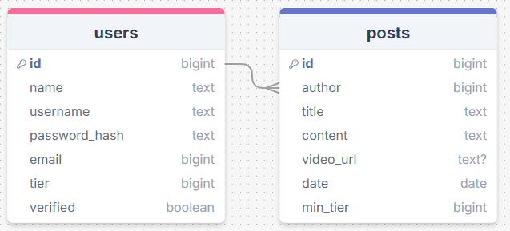
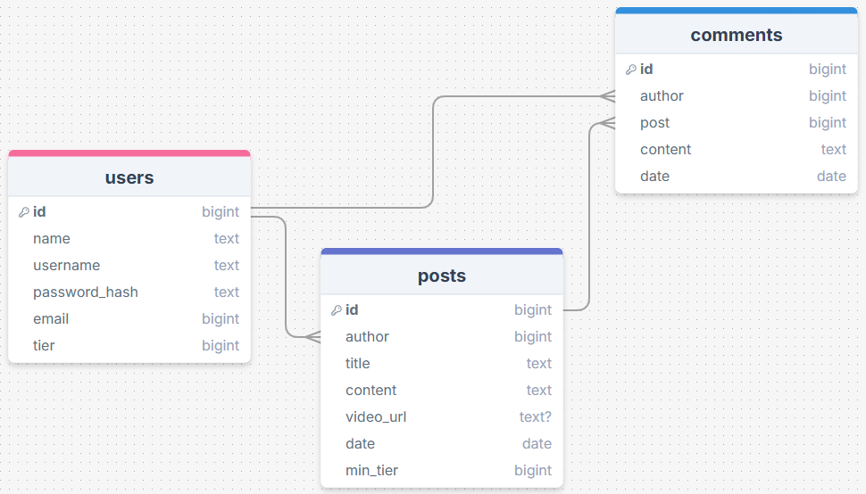

# Sprint 1 - A Working UI Prototype

## Sprint Goals

Develop a prototype that simulates the key functionality of the system, then test and refine it so that it can serve as the model for the next phase of development in Sprint 2.

[Figma](https://www.figma.com/) is used to develop the prototype.

---

## Initial Database Design

Replace this text with notes regarding the DB design.

The database will have a users table that has all the info on the user (tier, name, email). 
There will be a posts table with an author linked from the users table, and a comments table linked to a user and a post.

After I finished making this mockup I discussed the site further with my client. We soon understood that he wanted users to be able to post comments on people's posts.

> "I feel like it would make the site feel much more active to let users post comments."

I amended my database to have a comments table.

### Required Data Input

When creating an account, the user will provide important info such as their name and email. They will apply for a tier but this will only work if an admin verifies that they have paid.

For posts, values like the author and date will be generated automatically depending on who's making the post and when. The title, content and minimum tier will be directly entered by the author.

For comments, the author, post and date will be generated. The only thing supplied by the user is the main content.

### Required Data Output

Users will only have their username on display and maybe their tier to protect their privacy.

Posts will display the author, title, content and date. They will also embed the video link so that the video is watchable without leaving the site.

Comments will display the author's info, date and content.

### Required Data Processing

When the users create the password for their account, we will run it through a password hash for security reasons. This way, if we have a leak the passwords will be indecipherable.

---

## UI 'Flow'

18/07/2025

The first stage of prototyping was to explore how the UI might 'flow' between states, based on the required functionality.

This Figma demo shows the initial design for the UI 'flow':

<iframe style="border: 1px solid rgba(0, 0, 0, 0.1);" width="800" height="450" src="https://embed.figma.com/proto/tIPZUMTlOK6tkU3U4MgK0q/300DTD-Finance-1?node-id=1-3&p=f&scaling=min-zoom&content-scaling=fixed&page-id=0%3A1&starting-point-node-id=1%3A3&embed-host=share" allowfullscreen></iframe>

### Testing

Replace this text with notes about what you did to test the UI flow and the outcome of the testing.

### Changes / Improvements

> "I want to add a page that has more detailed information about the post like the date etc. It would feel better to make a post from the home page rather than having to click on my account. You should also be able to click on a post and view it from the users account. There needs to be an admin dashboard page where I can activate/control accounts."

- detailed view of posts when posts are clicked on
- make posts from account and home page
- admin dashboard to activate accounts

<iframe style="border: 1px solid rgba(0, 0, 0, 0.1);" width="800" height="450" src="https://embed.figma.com/proto/aN2B4ynyy9LErcBxPE8BQN/300DTD-Finance-1.5?node-id=1-3&p=f&scaling=min-zoom&content-scaling=fixed&page-id=0%3A1&starting-point-node-id=1%3A3&embed-host=share" allowfullscreen></iframe>

Because the admin must verify whether or not the user has paid, I must add a 'verified' column to the users table. This will be true or false so it must be a boolean.

---

## Initial UI Prototype

25/07/2025

The next stage of prototyping was to develop the layout for each screen of the UI.

This Figma demo shows the initial layout design for the UI:

<iframe style="border: 1px solid rgba(0, 0, 0, 0.1);" width="800" height="450" src="https://embed.figma.com/proto/LlO1ZkvAgD5UHY4UPaY7y2/300DTD-Finance-2?scaling=scale-down&content-scaling=fixed&page-id=0%3A1&node-id=2002-2&starting-point-node-id=2002%3A2&embed-host=share" allowfullscreen></iframe>

### Testing

Replace this text with notes about what you did to test the UI flow and the outcome of the testing.

### Changes / Improvements

> "Rounded corners on certain elements would make the site clearer and easier to read. The fields where text is entered are too large. I want The links on the navbar to look like buttons rather than text/links. The buttons on the landing take up too much room, I'd prefer them to be side by side. I think there needs to be a more clear way to indicate that the user is signed in, such as adding their name in the navbar instead of 'my account'. Having the logout button on so many pages seems redundant, I think it would be better to just have it on the user's account page."

- round corners
- navbar links look like buttons
- landing page buttons side by side
- username displayed on navbar when logged in
- logout page only on user account page

<iframe style="border: 1px solid rgba(0, 0, 0, 0.1);" width="800" height="450" src="https://embed.figma.com/proto/IJVfNhWAO7L2zfN3k6Vk2E/300DTD-Finance-3?node-id=2002-2&scaling=scale-down&content-scaling=fixed&page-id=0%3A1&starting-point-node-id=2002%3A2&embed-host=share" allowfullscreen></iframe>

After making these changes my client was happy with the design.

> "looks great!"

---

## Refined UI Prototype

Having established the layout of the UI screens, the prototype was refined visually, in terms of colour, fonts, etc.

This Figma demo shows the UI with refinements applied:

*FIGMA REFINED PROTOTYPE - PLACE THE FIGMA EMBED CODE HERE - MAKE SURE IT IS SET SO THAT EVERYONE CAN ACCESS IT*

### Testing

Replace this text with notes about what you did to test the UI flow and the outcome of the testing.

### Changes / Improvements

Replace this text with notes any improvements you made as a result of the testing.

*FIGMA IMPROVED REFINED PROTOTYPE - PLACE THE FIGMA EMBED CODE HERE - MAKE SURE IT IS SET SO THAT EVERYONE CAN ACCESS IT*

---

## Sprint Review

Replace this text with a statement about how the sprint has moved the project forward - key success point, any things that didn't go so well, etc.

