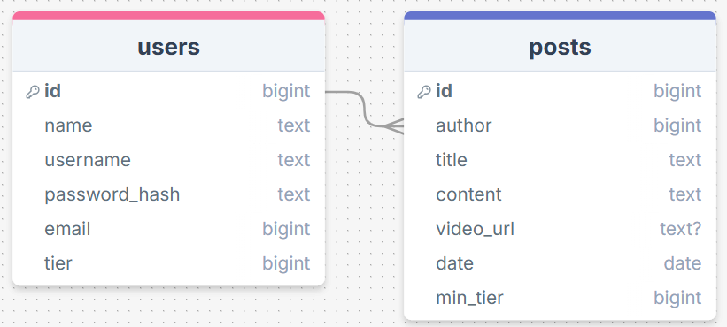
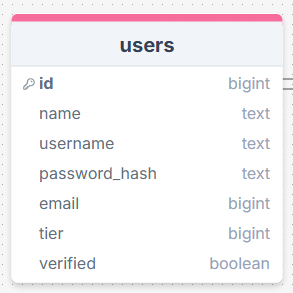

# Sprint 1 - A Working UI Prototype

## Sprint Goals

Develop a prototype that simulates the key functionality of the system, then test and refine it so that it can serve as the model for the next phase of development in Sprint 2.

[Figma](https://www.figma.com/) is used to develop the prototype.

---

## Initial Database Design

The database will have a users table that has all the info on the user (tier, name, email). 
There will be a posts table with an author linked from the users table, and a comments table linked to a user and a post.

After I finished making this mockup I discussed the site further with my client. We soon understood that he wanted users to be able to post comments on people's posts.

> "I feel like it would make the site feel much more active to let users post comments."

I amended my database to have a comments table.

### Required Data Input

When creating an account, the user will provide important info such as their name and email. They will select a specific tier which they will have to pay for.

For posts, values like the author and date will be generated automatically depending on who's making the post and when. The title, content and minimum tier will be directly entered by the author.

For comments, the author, post and date will be generated. The only thing supplied by the user is the main content.

### Required Data Output

Users will only have their username on display and maybe their tier to protect their privacy.

Posts will display the author, title, content and date. They will also embed the video link so that the video is watchable without leaving the site.

Comments will display the author's info, date and content.

### Required Data Processing

When the users create the password for their account, we will run it through a password hash for security reasons. This way, if we have a leak the passwords will be indecipherable.

---

## UI 'Flow'

18/07/2025

The first stage of prototyping was to explore how the UI might 'flow' between states, based on the required functionality.

This Figma demo shows the initial design for the UI 'flow':

<iframe style="border: 1px solid rgba(0, 0, 0, 0.1);" width="800" height="450" src="https://embed.figma.com/proto/tIPZUMTlOK6tkU3U4MgK0q/300DTD-Finance-1?node-id=1-3&p=f&scaling=min-zoom&content-scaling=fixed&page-id=0%3A1&starting-point-node-id=1%3A3&embed-host=share" allowfullscreen></iframe>

### Testing

I tested the flow by doing tasks that the user will commonly be doing such as logging in and creating posts.

I also provided my client with this UI flow model to get some feedback, as seen below.

### Changes / Improvements

> "I want to add a page that has more detailed information about the post like the date etc. It would feel better to make a post from the home page rather than having to click on my account. You should also be able to click on a post and view it from the users account. There needs to be an admin dashboard page where I can activate/control accounts."

- detailed view of posts when posts are clicked on
- make posts from account and home page
- admin dashboard to activate accounts

<iframe style="border: 1px solid rgba(0, 0, 0, 0.1);" width="800" height="450" src="https://embed.figma.com/proto/aN2B4ynyy9LErcBxPE8BQN/300DTD-Finance-1.5?node-id=1-3&p=f&scaling=min-zoom&content-scaling=fixed&page-id=0%3A1&starting-point-node-id=1%3A3&embed-host=share" allowfullscreen></iframe>

Because the admin must verify whether or not the user has paid, I must add a 'verified' column to the users table. This will be true or false so it must be a boolean.

---

## Initial UI Prototype

25/07/2025

The next stage of prototyping was to develop the layout for each screen of the UI.

This Figma demo shows the initial layout design for the UI:

<iframe style="border: 1px solid rgba(0, 0, 0, 0.1);" width="800" height="450" src="https://embed.figma.com/proto/LlO1ZkvAgD5UHY4UPaY7y2/300DTD-Finance-2?scaling=scale-down&content-scaling=fixed&page-id=0%3A1&node-id=2002-2&starting-point-node-id=2002%3A2&embed-host=share" allowfullscreen></iframe>

### Testing

I showed this prototype to my client and a potential user of the site. I told them to use it just as if they were actually interested in the service, but wanted to see how the site felt. Below is the feedback that I obtained. I also kept Nielsen's usability heuristics in mind when listening to their feedback.

### Changes / Improvements

> "Overall the website felt pretty good to use. Rounded corners on certain elements would make the site clearer and easier to read. The fields where text is entered are too large. I want The links on the navbar to look like buttons rather than text/links. The buttons on the landing take up too much room, I'd prefer them to be side by side. I think there needs to be a more clear way to indicate that the user is signed in, such as adding their name in the navbar instead of 'my account'. Having the logout button on so many pages seems redundant, I think it would be better to just have it on the user's account page."

- round corners
- navbar links look like buttons
- landing page buttons side by side
- username displayed on navbar when logged in
- logout page only on user account page

<iframe style="border: 1px solid rgba(0, 0, 0, 0.1);" width="800" height="450" src="https://embed.figma.com/proto/IJVfNhWAO7L2zfN3k6Vk2E/300DTD-Finance-3?node-id=2002-2&scaling=scale-down&content-scaling=fixed&page-id=0%3A1&starting-point-node-id=2002%3A2&embed-host=share" allowfullscreen></iframe>

After making these changes my client was happy with the design.

> "looks great!"

---

## Refined UI Prototype

01/06/2025

Having established the layout of the UI screens, the prototype was refined visually, in terms of colour, fonts, etc.

I used [Real Time Colors](https://www.realtimecolors.com/?colors=0C1613-FAFCFC-5CA58B-A1BBCB-7D8FB7&fonts=Inter-Inter) to generate this color palette.

This Figma demo shows the UI with refinements applied:

<iframe style="border: 1px solid rgba(0, 0, 0, 0.1);" width="800" height="450" src="https://embed.figma.com/proto/4IoJXtK2X5YmhsansBjAUh/300DTD-Finance-4?node-id=2002-2&p=f&scaling=scale-down&content-scaling=fixed&page-id=0%3A1&starting-point-node-id=2002%3A2&embed-host=share" allowfullscreen></iframe>

### Testing

I showed this color palette to my client, but he didn't like it.

> "I would prefer a darker blue as it feels more professional. I'd also rather have a deep red than that green color."

### Changes / Improvements

08/08/2025

I then generated a palette using the website [Real Time Colors](https://www.realtimecolors.com/?colors=0c153b-eef0f3-842828-374788-363d5a&fonts=Inter-Inter). I made some small adjustments to keep it in line with what my client requested and to keep the site readable. I then imported it into my mockup.
I also made some additional refinements such as adding profile icons for the comments.

<iframe style="border: 1px solid rgba(0, 0, 0, 0.1);" width="800" height="450" src="https://embed.figma.com/proto/AWuAyhNvED0q1mcBkyphB5/300DTD-Finance-5?node-id=2002-2&p=f&scaling=scale-down&content-scaling=fixed&page-id=0%3A1&starting-point-node-id=2002%3A2&embed-host=share" allowfullscreen></iframe>

After showing this to my client, he was much happier with the design.

> "That looks much better. I'm happy with this design."

---

## Sprint Review

To summarise the design stage of the site's development, I communicated with my client regularly and adapted my design to fit with their view. I changed the database, flow, structure and aesthetics of the website many times.

The design went well and was easy to make. [Excalidraw](https://excalidraw.com) was used to design the flow. [DrawSQL](https://drawsql.app) was used to make the database mockup. [Figma](https://www.figma.com/) was used to develop the working prototypes.

I am now finished the design stage ('sprint one') and am ready to start developing the site ('sprint two').

