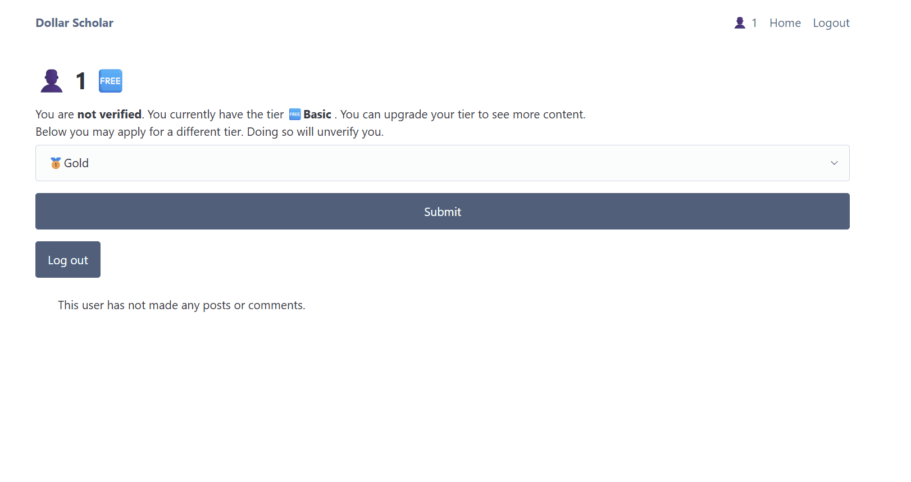
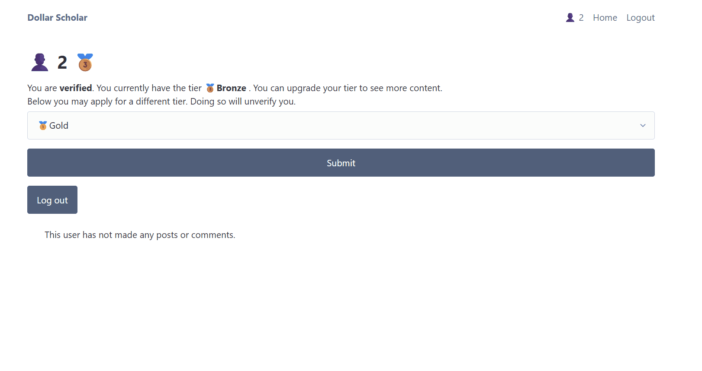
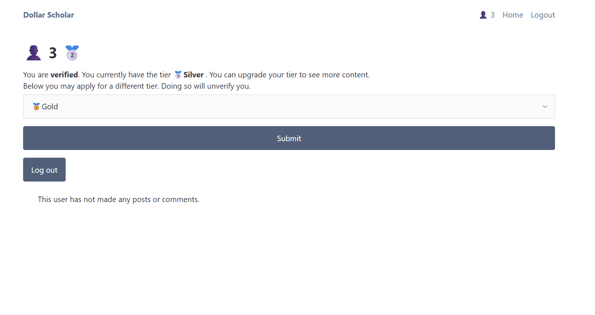
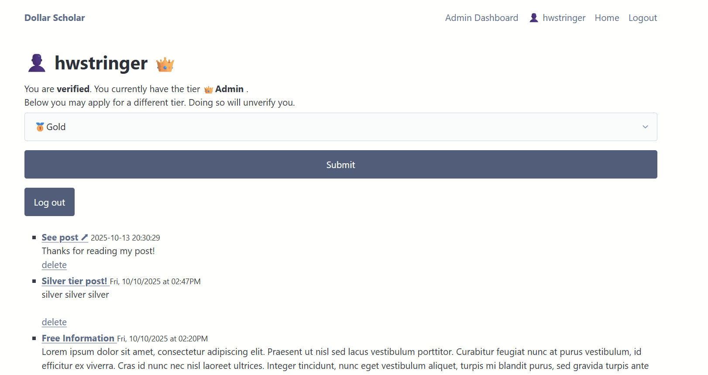
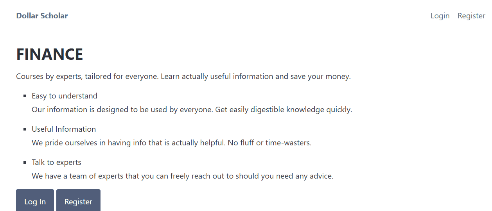
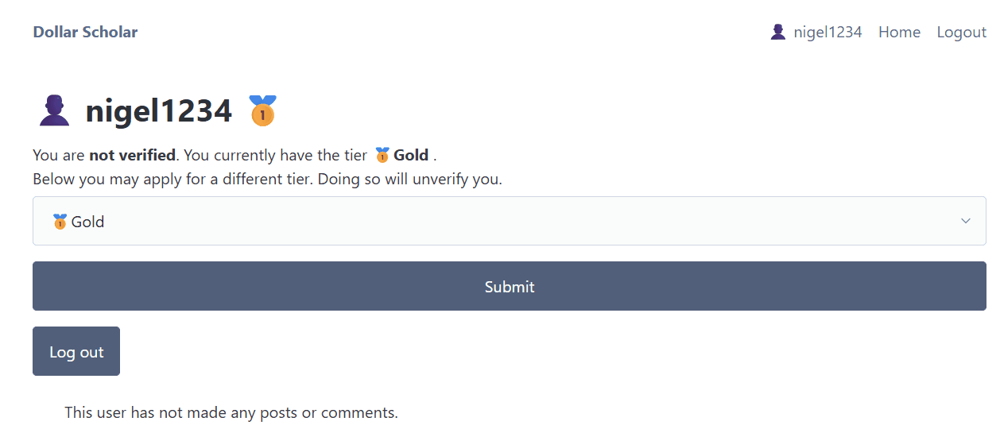
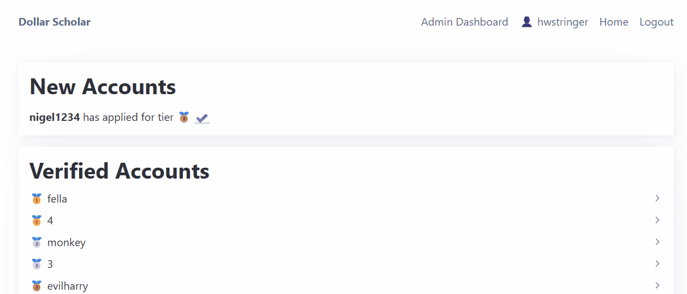

# Sprint 2 - A Minimum Viable Product (MVP)

## Sprint Goals

Develop a bare-bones, working web application that provides the key functionality of the system, then test and refine it so that it can serve as the basis for the final phase of development in Sprint 3.

---

## Implemented Database Schema

This schematic shows the final layout of the database that was used in my project.

The date is automatically generated with a timestamp in UTC. The video_id is the identifier of a YouTube link.

---

## Initial Implementation

The key functionality of the web app was implemented:

**PLACE SCREENSHOTS AND/OR ANIMATED GIFS OF THE SYSTEM HERE**

- Users can make and login to accounts
- When making an account, they select which tier they want. Basic, bronze, silver or gold. An admin tier also exists however users cannot apply for this tier upon account creation.
- Different account tiers dictate what the user can see. A basic account will only be able to see posts that are set to the basic tier. They cannot comment. Whereas someone with the gold tier, the highest tier, will be able to view all available posts and post comments.
- People are able to delete comments that they have made. Admins are able to delete any comment or post, even if they aren't the author.
- Only admins have permission to make posts
- Admins can manage people's account tiers. They are able to change them at will. Admins can also delete people's accounts.
- When a new account is created, it gets sent to the admin dashboard. If they have applied for a paid tier then they are expected to pay an admin on an external site. Once the user has paid, the admin will verify their account and they will have access to the tier.
- If a user's account is unverified, it will act as a free account until they are verified by an admin.
- If the user is on their own profile, there is an option for them to apply for a new account tier. Doing so will automatically unverify them.

---

## Testing Account Creation and Login

This shows how a user can create an account from the landing page, and then log in to it.

### Changes / Improvements

We can see that account creation works as intended. The user applies for a bronze tier, which should allow them to see free posts and bronze posts. However, their account has not yet been verified so they should not be able to see bronze posts. However, they should be able to see the free posts. They can't in this instance - it's a bug.

There was an issue with the logic regarding which posts unverified users can see. By slightly tweaking the conditions, we can see that now unverified accounts are able to see free posts.

---

## Testing Post Creation

Our user will try to create a post without being an admin account. There shouldn't be a button for him to click on to create a post, and he shouldn't be able to access the page by entering the url.

When creating a post, the admin can add all different features. The post is then created and can be viewed.

This all works as intended.

---

## Testing Post Visibility

Accounts that are unverified or with a low tier cannot view all posts. 

A basic or bronze tier user cannot see a silver tier post but a silver, gold or admin can.

The website says that the post is locked for our bronze tier user as it is a gold tier post, however we can still view the post. This is a bug.

By changing the link to redirect to the home page on locked posts, the lower tier users are not able to view the posts.

A gold tier user can see the post.

After fixing this bug, the site works as intended. Only tiers at or higher than the level of the post can open it.

---

## Testing Comments

Different tiers allow for different abilities regarding comments.

- Basic tiers can't see or post any comments
- Bronze tier can see comments but can't post comments
- Gold and Silver can see and post comments, and delete their own comments
- Admins can see and post comments, and delete any comment

### Basic account

The basic account can't see any comments, no post comments

### Bronze account

The bronze account can see comments, but not post their own

### Silver & Gold accounts

The bronze account can see comments, but not post their own

### Admin account

The admin should be able to delete comments that they didn't author. The delete popup appears, but pressing it doesn't actually delete the comment. This is because the website checks that the person deleting the comment is the author as a safety measure. Changing this resolved the issue.

---

## Testing Admin Account Verification

Here a new user creates an account. When the account has been created, it will appear at the top of the admin dashboard, requiring verification. Once the user has paid, the admin will verify their account and they will have access to the perks that their tier supplies.

We can see that the account has not yet been verified. The admin then verifies the account, and they get access to their perks.

This all works as intended.

---

## Testing Tier Changes

Once a user has made their account, they are able to change their tier. doing so will unverify them.

Admins can also change a user's tier in the admin dashboard.

Here a gold tier user applies for bronze tier. When they have their gold tier, they can see all the posts. When they apply for silver, it changes their tier immediately but unverifies them. They will then need to be re-verified by an admin.

Here a user for some reason a user must have their tier changed. An admin can do this from the admin dashboard without a user applying for a different tier. The user will not have to be re-verified as this was done by an admin.

---

## Sprint Review

This sprint has gone smoothly with the mvp now finished. All of the functionality of the site works. Next I will need to style the site and make sure that it looks good.

I showed the mvp to my client and he said

> "That all seems to work how i wanted it. I'm looking forward to seeing it after it looks good!"

