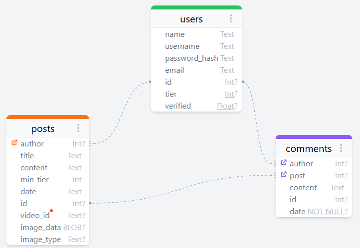
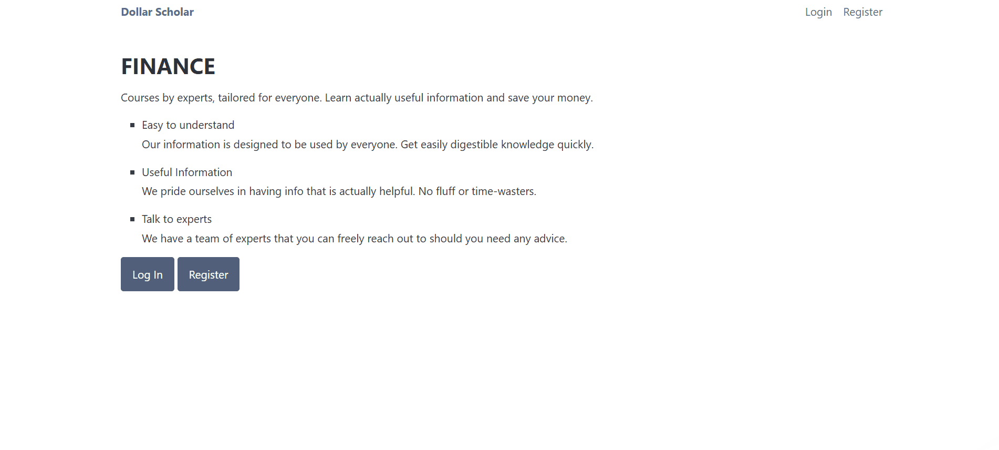
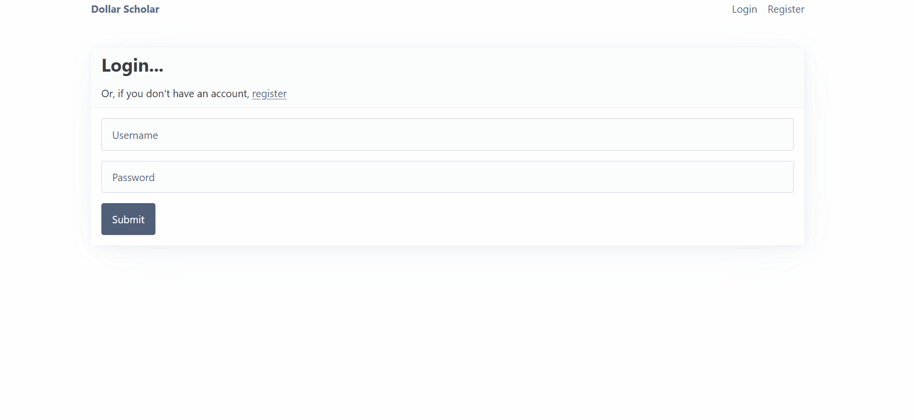
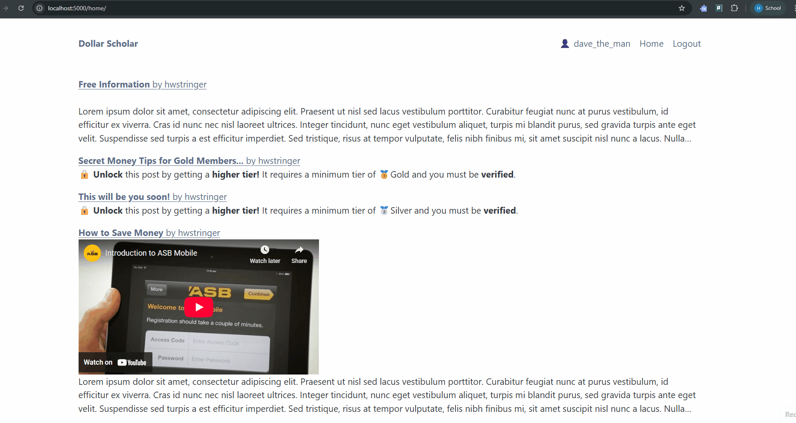
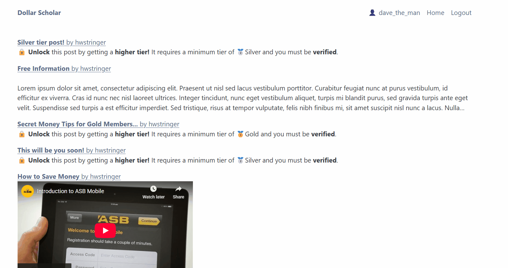
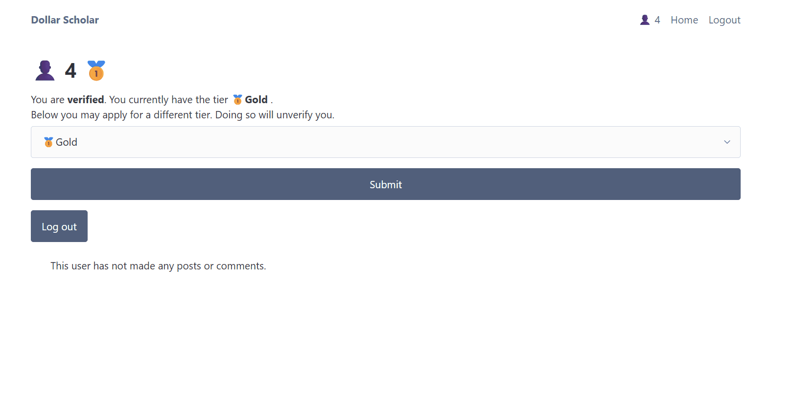

# Sprint 2 - A Minimum Viable Product (MVP)

## Sprint Goals

Develop a bare-bones, working web application that provides the key functionality of the system, then test and refine it so that it can serve as the basis for the final phase of development in Sprint 3.

---

## Implemented Database Schema

This schematic shows the final layout of the database that was used in my project.

The date is automatically generated with a timestamp in UTC. The video_id is the identifier of a YouTube link.

---

## Initial Implementation

The key functionality of the web app was implemented:

**PLACE SCREENSHOTS AND/OR ANIMATED GIFS OF THE SYSTEM HERE**

- Users can make and login to accounts
- When making an account, they select which tier they want. Basic, bronze, silver or gold. An admin tier also exists however users cannot apply for this tier upon account creation.
- Different account tiers dictate what the user can see. A basic account will only be able to see posts that are set to the basic tier. They cannot comment. Whereas someone with the gold tier, the highest tier, will be able to view all available posts and post comments.
- People are able to delete comments that they have made. Admins are able to delete any comment or post, even if they aren't the author.
- Only admins have permission to make posts
- Admins can manage people's account tiers. They are able to change them at will. Admins can also delete people's accounts.
- When a new account is created, it gets sent to the admin dashboard. If they have applied for a paid tier then they are expected to pay an admin on an external site. Once the user has paid, the admin will verify their account and they will have access to the tier.
- If a user's account is unverified, it will act as a free account until they are verified by an admin.
- If the user is on their own profile, there is an option for them to apply for a new account tier. Doing so will automatically unverify them.

---

## Testing Account Creation and Login

This shows how a user can create an account from the landing page, and then log in to it.

### Changes / Improvements

We can see that account creation works as intended. The user applies for a bronze tier, which should allow them to see free posts and bronze posts. However, their account has not yet been verified so they should not be able to see bronze posts. However, they should be able to see the free posts. They can't in this instance - it's a bug.

There was an issue with the logic regarding which posts unverified users can see. By slightly tweaking the conditions, we can see that now unverified accounts are able to see free posts.

---

## Testing Post Creation

Our user will try to create a post without being an admin account. There shouldn't be a button for him to click on to create a post, and he shouldn't be able to access the page by entering the url.

When creating a post, the admin can add all different features. The post is then created and can be viewed.

This all works as intended.

---

## Testing Post Visibility

Accounts that are unverified or with a low tier cannot view all posts. 

A basic or bronze tier user cannot see a silver tier post but a silver, gold or admin can.

The website says that the post is locked for our bronze tier user as it is a gold tier post, however we can still view the post. This is a bug.

By changing the link to redirect to the home page on locked posts, the lower tier users are not able to view the posts.

A gold tier user can see the post.

**PLACE SCREENSHOTS AND/OR ANIMATED GIFS OF THE TESTING HERE**

### Changes / Improvements

Replace this text with notes any improvements you made as a result of the testing.

**PLACE SCREENSHOTS AND/OR ANIMATED GIFS OF THE IMPROVED SYSTEM HERE**

---

## Testing FEATURE NAME HERE

Replace this text with notes about what you are testing, how you tested it, and the outcome of the testing

**PLACE SCREENSHOTS AND/OR ANIMATED GIFS OF THE TESTING HERE**

### Changes / Improvements

Replace this text with notes any improvements you made as a result of the testing.

**PLACE SCREENSHOTS AND/OR ANIMATED GIFS OF THE IMPROVED SYSTEM HERE**

---

## Testing FEATURE NAME HERE

Replace this text with notes about what you are testing, how you tested it, and the outcome of the testing

**PLACE SCREENSHOTS AND/OR ANIMATED GIFS OF THE TESTING HERE**

### Changes / Improvements

Replace this text with notes any improvements you made as a result of the testing.

**PLACE SCREENSHOTS AND/OR ANIMATED GIFS OF THE IMPROVED SYSTEM HERE**

---

## Sprint Review

Replace this text with a statement about how the sprint has moved the project forward - key success point, any things that didn't go so well, etc.

