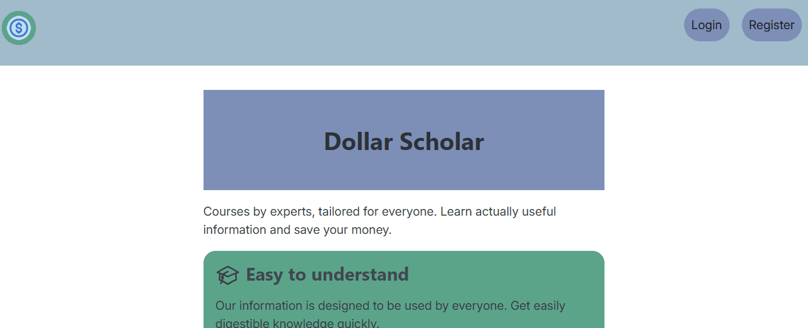
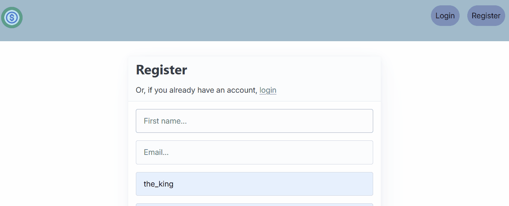
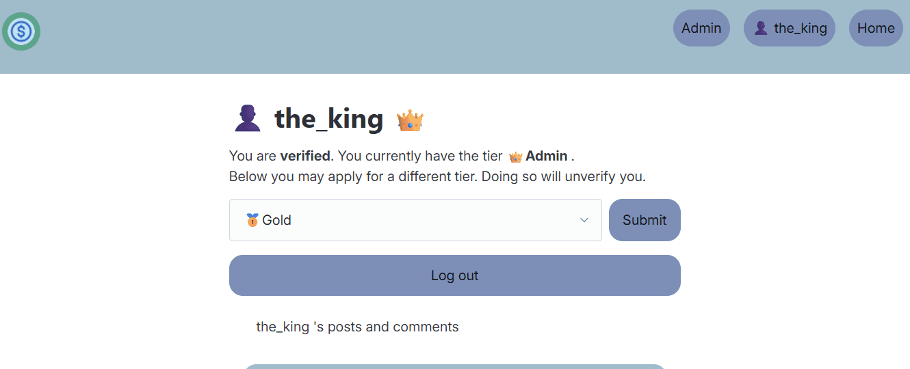
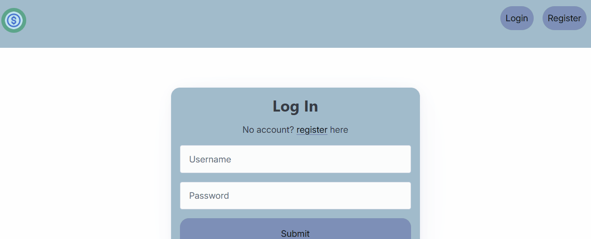
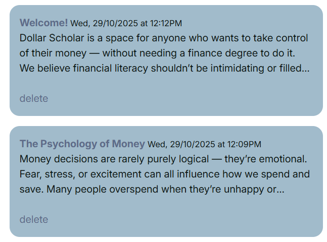
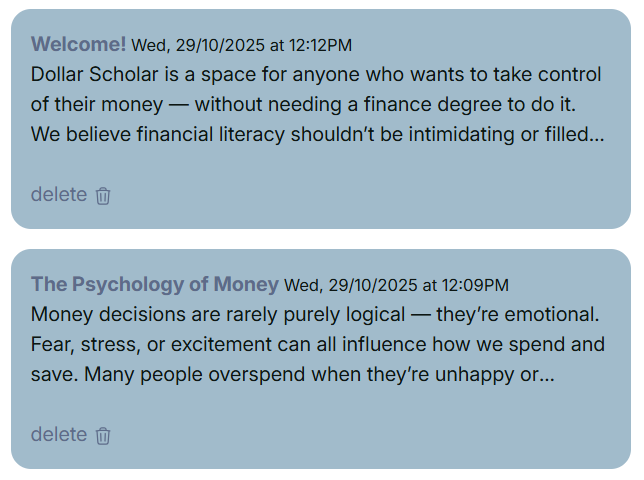
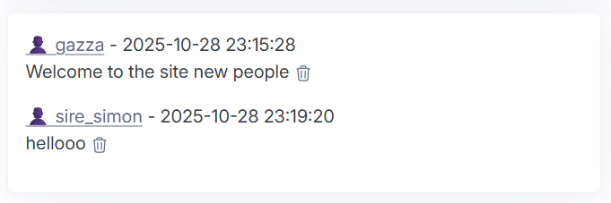
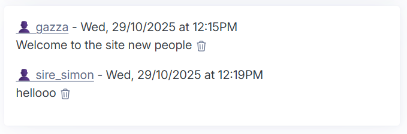
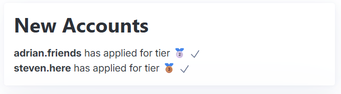
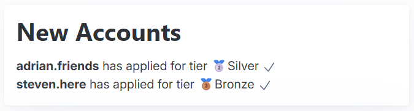

# Sprint 3 - A Refined and Complete System

## Sprint Goals

Develop the system until it is fully featured, with a refined UI and it satisfies the requirements. The system will be fully tested at this point.

---

## Final Implementation

The web app is fully implemented with a refined UI:

Landing page

Account registration

Logging in

Account Verification

Making a post

Making and deleting comments

Deleting a post

User without adequate tier

---

## User Interface Changes

Just having the text "delete" looks a little bit unrefined, common website conventions would use an icon. During my latest meeting with my client, I asked about whether or not he felt an icon would be better.

> "Well I think having the delete text is fine, but for accessibility and icon would be beneficial as well. Could you put a bin icon next to it?"

I then followed this sentiment and added an svg icon next to the delete text. I will follow this convention through out the site, to keep things accessible for everyone.

---

I also realised that whilst posts had a readable date and time, the comments did not. 

This would not fit with the rest of the site and it is not very friendly for users to read, so I added a format that is consistent with the rest of the site.

---

Another piece of feedback I got from my client was:

> "It would be good if it also said the name of the tier next to the tier icon, just so I can easily read it"

To resolve this, I used a jinja filter to add the text next to the icon.

---

## Sprint Review

This sprint went very smoothly and quickly. It just consisted of me styling the site and making slight adjustments and tweaks to things. I already knew what the site was supposed to look like because of my figma mockup that I made for my client.

